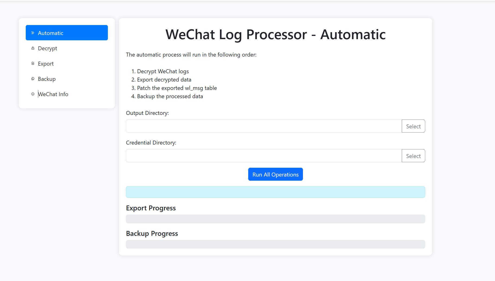

# Wechatlog app

# 如何安装

从 https://drive.google.com/drive/folders/1bfm7Kpc1-FaUpJk_j20JPVtvkZIf7b5a?usp=drive_link 下载并解压dist.zip 和 credentials， 出于安全原因 credentials 和app分别distribute

确保window上安装有edge浏览器，解压dist.zip后运行`main.exe` 就可以再浏览器上显示界面

# 如何使用

## Automatic

<aside>
💡

此模式下需要微信同时运行，如果微信没有运行自动模式会失败

</aside>

此模式下会自动解密，导出并备份所有该电脑上的微信数据，

用户需要选择

1. 想储存导出微信数据的的地址
2. 从google drive下载的credentials文件夹。

<aside>
💡

如提示登录google账号必须使用lsdforum orgnization下的邮箱登录

</aside>

## Decrypt

只运行解密模组

用户需要选择

1. wechat path, wechat path 是wechat File\{wx id} 文件夹 一般在document文件夹下
2. decrypt key，用于解密数据库。 可以从wechat info 页面获取
3. output path， 储存解密后数据库

## Export

只运行导出模组

Path to Merge DB

解密的merge_all.db 的位置

Wechat Root

wechat file\{wx id} 的地址

output directory

导出解密后语音，图片到的位置。可以是任意位置

## Backup

DB Path：

merge_all.db 的地址

WeChat Root：

wechat file\{wx id} 的地址

output directory

导出模组导出解密语音，图片到的位置

Credential Directory

从google drive下载的credential folder 的位置

## Wechat Info

用来获得解密微信的信息，微信需要同时运行

